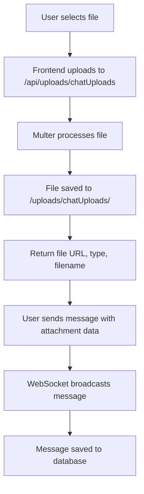

# 💬 Chat System with File Attachments

## 🚀 Features Implemented

### ✅ **Backend Features**
- **WebSocket Real-time Chat** - Instant messaging with ws://localhost:3001/chat
- **File Attachments** - Support for images, PDFs, documents, Excel files, videos, audio
- **Global Chat** - Public chat room for all users
- **Direct Messaging** - Private 1-on-1 conversations
- **Typing Indicators** - See when users are typing
- **Online Status** - See who's online/offline
- **Message Types** - Text, attachment, or mixed messages
- **Message History** - Persistent storage in PostgreSQL
- **User Authentication** - JWT-based WebSocket authentication

### ✅ **File Upload System**
- **Endpoint**: `POST /api/uploads/chatUploads`
- **Storage**: Local filesystem under `/uploads/chatUploads/`
- **File Types**: Images, PDFs, Word docs, Excel, videos, audio
- **File Size Limit**: 10MB per file
- **Unique Naming**: `timestamp_userid_originalname`
- **Type Detection**: Automatic MIME type categorization

### ✅ **Database Schema**
```sql
chat_messages:
- message_id (PRIMARY KEY)
- sender_id (NOT NULL, FK to users)
- receiver_id (NULL for global chat, FK to users)
- content (NULL allowed if attachment only)
- attachment_url (NULL allowed)
- attachment_type (ENUM: image, pdf, doc, excel, video, audio, other)
- attachment_filename (Original filename)
- message_type (ENUM: text, attachment, mixed)
- timestamp (AUTO)
```

---

## 🔧 **API Endpoints**

### **REST API**
```
GET    /api/chat/messages              - Get messages (with filters)
POST   /api/chat/messages              - Send message (backup to WebSocket)
GET    /api/chat/conversations         - Get conversation list
DELETE /api/chat/messages/:message_id  - Delete message
POST   /api/uploads/chatUploads        - Upload attachment
```

### **WebSocket Messages**
```javascript
// Connect with authentication
ws://localhost:3001/chat?token=JWT_TOKEN

// Send message
{
  type: 'send_message',
  receiver_id: 'global' | user_id,
  content: 'Hello world!',
  attachment_url: '/uploads/chatUploads/file.jpg',
  attachment_type: 'image',
  attachment_filename: 'photo.jpg'
}

// Typing indicators
{
  type: 'typing_start',
  receiver_id: 'global' | user_id
}

{
  type: 'typing_stop', 
  receiver_id: 'global' | user_id
}
```

---

## 🎯 **Message Broadcasting Logic**

### **Global Messages** (`receiver_id: null`)
- ✅ Broadcast to **ALL** connected users
- ✅ Saved to database with `receiver_id = null`
- ✅ Visible to everyone in global chat

### **Direct Messages** (`receiver_id: specific_user_id`)
- ✅ Send to **sender and receiver only**
- ✅ Saved to database with specific `receiver_id`
- ✅ Private conversation between two users

### **Typing Indicators**
- ✅ Global typing → Broadcast to everyone except sender
- ✅ DM typing → Send to specific recipient only

---

## 🏗️ **File Upload Flow**



---

## 📝 **Usage Examples**

### **1. Text Message**
```javascript
// WebSocket send
ws.send(JSON.stringify({
  type: 'send_message',
  receiver_id: 'global',
  content: 'Hello everyone!'
}));
```

### **2. File Upload + Message**
```javascript
// 1. Upload file first
const formData = new FormData();
formData.append('file', selectedFile);

const uploadResponse = await fetch('/api/uploads/chatUploads', {
  method: 'POST',
  headers: { 'Authorization': `Bearer ${token}` },
  body: formData
});

const { url, type, filename } = uploadResponse.data;

// 2. Send message with attachment
ws.send(JSON.stringify({
  type: 'send_message',
  receiver_id: 'global',
  content: 'Check out this file!',
  attachment_url: url,
  attachment_type: type,
  attachment_filename: filename
}));
```

### **3. Direct Message**
```javascript
ws.send(JSON.stringify({
  type: 'send_message',
  receiver_id: 123, // Specific user ID
  content: 'Hey, this is private!'
}));
```

---

## 🎨 **Frontend Integration Guide**

### **1. WebSocket Connection**
```javascript
const token = localStorage.getItem('token');
const ws = new WebSocket(`ws://localhost:3001/chat?token=${token}`);

ws.onopen = () => console.log('Connected to chat');
ws.onmessage = (event) => {
  const data = JSON.parse(event.data);
  handleIncomingMessage(data);
};
```

### **2. Message Types to Handle**
- `connection_success` - Successfully connected
- `new_message` - New message received
- `message_sent` - Confirmation of sent message
- `user_typing_start/stop` - Typing indicators
- `user_status` - User online/offline status
- `error` - Error occurred

### **3. File Upload Component**
```javascript
const handleFileUpload = async (file) => {
  const formData = new FormData();
  formData.append('file', file);
  
  const response = await fetch('/api/uploads/chatUploads', {
    method: 'POST',
    headers: { 'Authorization': `Bearer ${token}` },
    body: formData
  });
  
  return response.json();
};
```

---

## 🔒 **Security Features**

- ✅ **JWT Authentication** - WebSocket connections require valid JWT
- ✅ **File Type Validation** - Only allowed MIME types accepted
- ✅ **File Size Limits** - 10MB maximum upload size
- ✅ **User Authorization** - Users can only delete their own messages
- ✅ **Input Sanitization** - Content validation and error handling

---

## 🎉 **Ready to Use!**

The chat system is now fully implemented and ready for frontend integration. Key features:

1. ✅ **Real-time messaging** via WebSocket
2. ✅ **File attachments** with proper handling
3. ✅ **Global and direct messaging**
4. ✅ **Persistent message history**
5. ✅ **Typing indicators and online status**
6. ✅ **Secure authentication**

**Next Steps**: Build the React frontend components to interact with this backend system!

---

**Last Updated**: 2025-10-04
